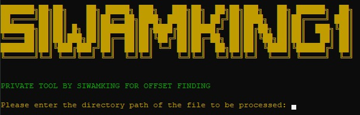

# Mini Miltia Auto Dump lib and extract offset



Automate the process of dumping a specified library and extracting offsets using `radare2` and `rabin2` across multiple platforms.

## Features

- **Automated Process**: Quickly dump a specified library and extract offsets with minimal user input.
- **Platform Support**: Works seamlessly on Linux, Windows, and Termux environments.
- **Customizable Output**: Choose the directory to store the dump file and specify the output file path for extracted offsets.
- **Error Handling**: Built-in error handling for path validation, permissions, and installation processes.

## Usage

1. **Installation**:
   - **Linux**: Run `sudo apt-get install radare2` to install `radare2`.
   - **Windows**: Install `radare2` using `choco install radare2`.
   - **Termux (Android)**: Execute `pkg install radare2` to install `radare2`.

2. **Run the Script**:
   - Clone the repository:
     ```
     git clone https://github.com/siwamking1/mini_militia_mod_maker.git
     cd mini_militia_mod_maker
     python sk.py
     ```
   
3. **Input Required**:
   - Enter the path of the library (`libcocos2dcpp.so`, `.dll`, etc.) you want to analyze.
   - Specify the directory to store the dump file and the library itself.
   - Provide the path for the output text file to save the extracted offsets.

4. **Output**:
   - The script will automatically dump the library and extract offsets using `rabin2`.
   - Outputs are saved to the specified text file for further analysis or integration.

## Contributing

Contributions are welcome! Please fork the repository and submit pull requests.

## License

This project is licensed under the MIT License. See the [LICENSE](LICENSE) file for details.

##Note: Editing, using without credit, or modifying the code without permission is not allowed. Please ensure to respect the project's licensing terms and give proper attribution when using or sharing this code.

## Credits

- Developed by [siwamking1](https://github.com/siwam-king1)

---

